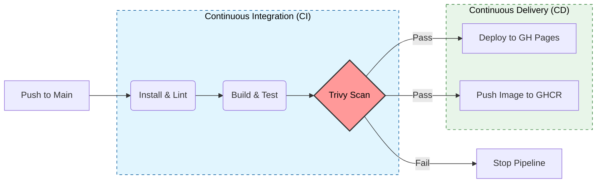

# Shopify - DevOps Technical Assignment


This repository contains the solution for the **ABB DevOps Assignment**. The goal was to containerize a React eCommerce application and implement a secure, automated CI/CD pipeline using DevOps best practices.

## 🚀 Deployment & DevOps Architecture

### Pipeline Workflow
The solution implements a GitHub Actions pipeline that ensures code quality, security, and automated delivery.



### Architecture Decisions

| Component | Choice | Rationale & Benefits |
| --- | --- | --- |
| **CI/CD** | GitHub Actions | Native integration, zero-overhead setup, and immediate feedback loop. |
| **Hosting** | GitHub Pages | Acts as the **Test Environment**. Perfect for SPA (Single Page Applications), cost-effective, and supports HTTPS automatically. |
| **Container** | Docker Multi-stage | **Efficiency**: Separates build tools (Node) from runtime (Nginx) to minimize image size.<br>

<br>**Security**: Runs Nginx Alpine to reduce attack surface. |
| **Registry** | GHCR | Keeps artifacts close to the code. Images are versioned by commit SHA for traceability. |
| **Security** | Trivy | Scans the final Docker image for OS/Library vulnerabilities (Critical severity blocks deployment). |

---

## 🛠️ How to Run

### Prerequisites

* Docker & Docker Compose

### Run with Docker

This uses the optimized multi-stage Dockerfile with Nginx to serve the production build.

```bash
# 1. Build and start the container
docker compose up --build
```

**2. Access the application at: [http://localhost:8080](http://localhost:8080)**

### Stopping Docker Containers

To stop the running Docker containers:

```bash
# Stop and remove containers
docker compose down

# Stop containers without removing them
docker compose stop
```

---

## ✅ Verification Links

Once the pipeline finishes successfully, you can verify the deployment here:

* **Live Test Environment:** [https://luismlgdev.github.io/test-abb/](https://luismlgdev.github.io/test-abb/)
* **Docker Registry:** `ghcr.io/luismlgdev/test-abb`
* **Pipeline Logs:** [View Actions Tab](https://github.com/LuisMLGDev/test-abb/actions)

---

## 📦 Application Features

*Based on the Simple React eCommerce application.*

This project is a dummy e-commerce application built using React, Tailwind CSS, Vite, TypeScript, and Redux Toolkit.

* **Homepage:** Banners, featured products, and navigation.
* **Product Page:** Detailed information, images, and pricing.
* **Cart:** Add products, view contents, and checkout simulation.
* **User Simulation:** Login simulation for wishlist and account features.
* **Testing:** End-to-End testing with **Cypress**.

## 📄 License

This project is part of a technical assignment. Original application code is licensed under the [MIT License](https://www.google.com/search?q=LICENSE).


